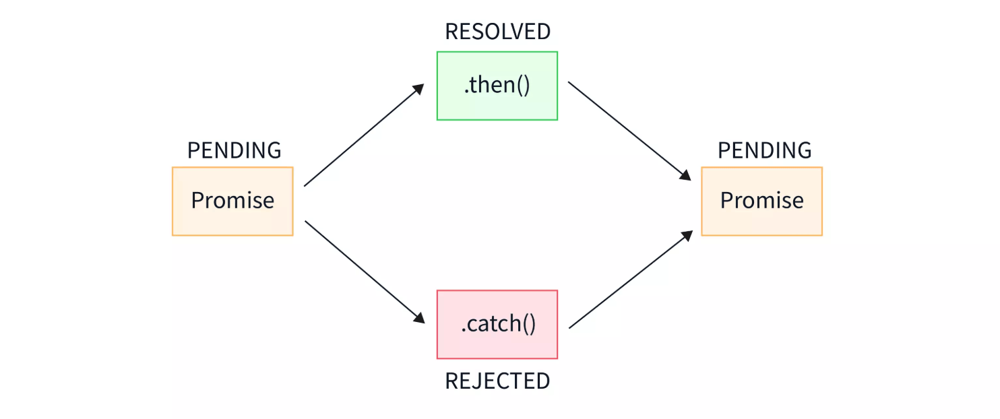
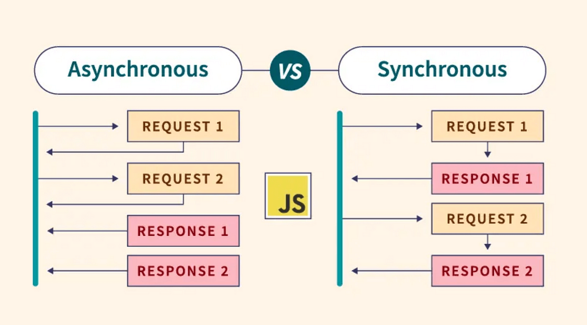
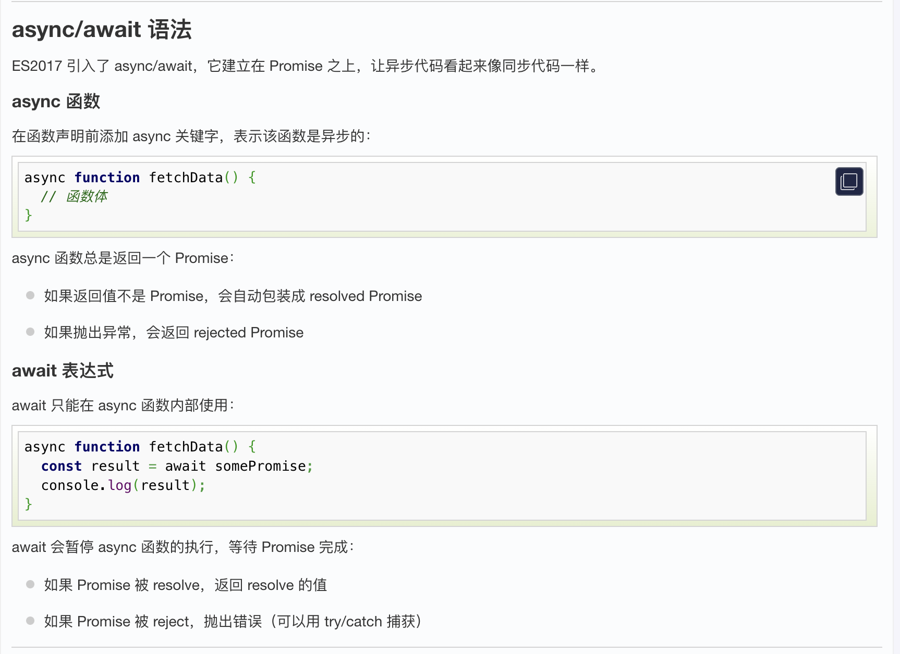

## JavaScript 异步编程

[JavaScript 异步编程](https://www.runoob.com/js/js-async.html)


什么时候用异步编程
在前端编程中（甚至后端有时也是这样），我们在处理一些简短、快速的操作时，例如计算 1 + 1 的结果，往往在主线程中就可以完成。主线程作为一个线程，不能够同时接受多方面的请求。所以，当一个事件没有结束时，界面将无法处理其他请求。

现在有一个按钮，如果我们设置它的 onclick 事件为一个死循环，那么当这个按钮按下，整个网页将失去响应。

为了避免这种情况的发生，我们常常用子线程来完成一些可能消耗时间足够长以至于被用户察觉的事情，比如读取一个大文件或者发出一个网络请求。因为子线程独立于主线程，所以即使出现阻塞也不会影响主线程的运行。但是子线程有一个局限：一旦发射了以后就会与主线程失去同步，我们无法确定它的结束，如果结束之后需要处理一些事情，比如处理来自服务器的信息，我们是无法将它合并到主线程中去的。

为了解决这个问题，JavaScript 中的异步操作函数往往通过回调函数来实现异步任务的结果处理。
回调函数
回调函数就是一个函数，它是在我们启动一个异步任务的时候就告诉它：等你完成了这个任务之后要干什么。这样一来主线程几乎不用关心异步任务的状态了，他自己会善始善终。
```

function doAsyncTask(callback) {
  setTimeout(function() {
    // 异步任务完成
    callback('任务完成');
  }, 1000);
}

doAsyncTask(function(result) {
  console.log(result); // 输出：任务完成
});

```

## AjAX 
[ajax](https://www.runoob.com/ajax/ajax-tutorial.html)

XMLHttpRequest 的 onload 和 onerror 属性都是函数，分别在它请求成功和请求失败时被调用。如果你使用完整的 jQuery 库，也可以更加优雅的使用异步 AJAX：

## JavaScript  promise
[javascript promise](https://www.runoob.com/js/js-promise.html)



Promise 是 JavaScript 中用于处理异步操作的对象，它代表一个异步操作的最终完成（或失败）及其结果值。
```
const myPromise = new Promise((resolve, reject) => {
  // 异步操作代码
  
  if (/* 操作成功 */) {
    resolve('成功的结果'); // 将 Promise 状态改为 fulfilled
  } else {
    reject('失败的原因'); // 将 Promise 状态改为 rejected
  }
});
```

## JavaScript async/await
[JavaScript async/await](https://www.runoob.com/js/js-async-await.html)

JavaScript 是单线程语言，意味着它一次只能执行一个任务。为了避免长时间运行的任务阻塞主线程，JavaScript 使用异步编程模型。




## Callback Hell
[Callback hell](https://www.runoob.com/js/js-async-await.html)
Callback Hell

```
getData(function(a) {
  getMoreData(a, function(b) {
    getMoreData(b, function(c) {
      getMoreData(c, function(d) {
        console.log(d);
      });
    });
  });
});
```

Promise 的引入
ES6 引入了 Promise 对象来解决回调地狱问题。

实例
```
function getData() {
  return new Promise((resolve, reject) => {
    // 异步操作
    setTimeout(() => resolve('数据'), 1000);
  });
}

getData()
  .then(data => {
    console.log(data);
    return getMoreData(data);
  })
  .then(moreData => {
    console.log(moreData);
  })
  .catch(error => {
    console.error(error);
  });

  ```
虽然 Promise 改善了回调问题，但 then() 链式调用仍然不够直观。



## javaScript standard 
[javaScript standard](https://www.runoob.com/js/js-conventions.html)

##
The name variable use the 驼峰法来命名。（camelCase):
空格与运算符
通常运算符 ( = + - * / ) 前后需要添加空格:
```
var x = y + z;var values = ["Volvo", "Saab", 
 "Fiat"];
 ```
 代码缩进
通常使用 4 个空格符号来缩进代码块：

语句规则
简单语句的通用规则:

一条语句通常以分号作为结束符。
实例:
var values = ["Volvo", "Saab", "Fiat"];

var person = {
    firstName: "John",
    lastName: "Doe",
    age: 50,
    eyeColor: "blue"
};
复杂语句的通用规则:

将左花括号放在第一行的结尾。
左花括号前添加一空格。
将右花括号独立放在一行。
以分号结束一个复杂的声明。


## Function()
```
function toCelsius(fahrenheit) {
    return (5 / 9) * (fahrenheit - 32);
}

```
## loop
```
for (i = 0; i < 5; i++) {    x += i;}
```

# #if sentence
```
if (time < 20) {    greeting = "Good day";} else {    
 greeting = "Good evening";}

 ```
 ## object
 
```
var person = {    firstName: "John",    
 lastName: "Doe",    age: 50,    eyeColor: 
 "blue"};

 ```
 ## short object
 ```
 var person = {firstName:"John", lastName:"Doe", age:50, eyeColor:"blue"};

 ```
 	- 通常在 JavaScript 中被认为是减法，所以不允许使用。

  ## capital world.
  使用小写文件名
大多 Web 服务器 (Apache, Unix) 对大小写敏感： london.jpg 不能通过 London.jpg 访问。

其他 Web 服务器 (Microsoft, IIS) 对大小写不敏感： london.jpg 可以通过 London.jpg 或 london.jpg 访问。

你必须保持统一的风格，我们建议统一使用小写的文件名。
## function definition 

[JavaScript 函数定义](https://www.runoob.com/js/js-function-definition.html)

```
function functionName(parameters) {
  执行的代码
}

```
