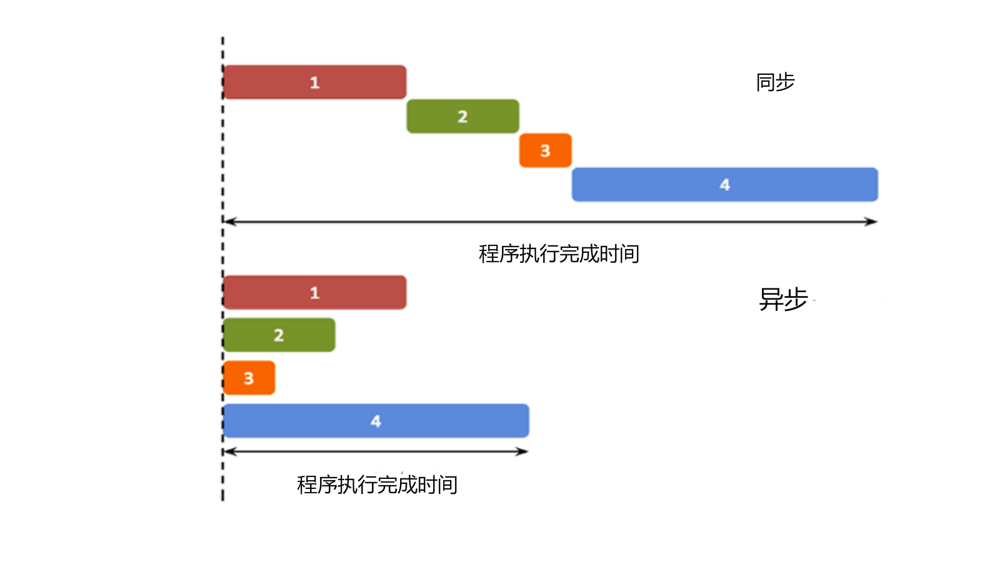

## JavaScript 异步编程

[JavaScript 异步编程](https://www.runoob.com/js/js-async.html)



什么时候用异步编程
在前端编程中（甚至后端有时也是这样），我们在处理一些简短、快速的操作时，例如计算 1 + 1 的结果，往往在主线程中就可以完成。主线程作为一个线程，不能够同时接受多方面的请求。所以，当一个事件没有结束时，界面将无法处理其他请求。

现在有一个按钮，如果我们设置它的 onclick 事件为一个死循环，那么当这个按钮按下，整个网页将失去响应。

为了避免这种情况的发生，我们常常用子线程来完成一些可能消耗时间足够长以至于被用户察觉的事情，比如读取一个大文件或者发出一个网络请求。因为子线程独立于主线程，所以即使出现阻塞也不会影响主线程的运行。但是子线程有一个局限：一旦发射了以后就会与主线程失去同步，我们无法确定它的结束，如果结束之后需要处理一些事情，比如处理来自服务器的信息，我们是无法将它合并到主线程中去的。

为了解决这个问题，JavaScript 中的异步操作函数往往通过回调函数来实现异步任务的结果处理。
回调函数
回调函数就是一个函数，它是在我们启动一个异步任务的时候就告诉它：等你完成了这个任务之后要干什么。这样一来主线程几乎不用关心异步任务的状态了，他自己会善始善终。
```

function doAsyncTask(callback) {
  setTimeout(function() {
    // 异步任务完成
    callback('任务完成');
  }, 1000);
}

doAsyncTask(function(result) {
  console.log(result); // 输出：任务完成
});

```
