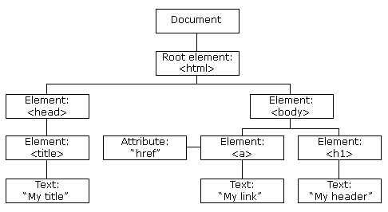

## JavaScript HTML DOM
[JavaScript HTML DOM](https://www.runoob.com/js/js-htmldom.html)

JavaScript 能够改变页面中的所有 HTML 元素
JavaScript 能够改变页面中的所有 HTML 属性
JavaScript 能够改变页面中的所有 CSS 样式
JavaScript 能够对页面中的所有事件做出反应

## Find element
id , element .class
HTML DOM 教程
在本教程接下来的篇幅中，您将学到：

如何改变 HTML 元素的内容 (innerHTML)
如何改变 HTML 元素的样式 (CSS)
如何对 HTML DOM 事件做出反应
如何添加或删除 HTML 元素

## HTML 

[HTML DOM](https://www.w3schools.com/js/js_htmldom.asp)

[HTML DOM](https://www.runoob.com/js/js-htmldom-html.html)

JavaScript HTML DOM - 改变 HTML

## HTML stype property

[Javascript to change style property](https://www.runoob.com/js/js-htmldom-css.html)

## Html event .

HTML DOM 允许我们通过触发事件来执行代码。

比如以下事件：

元素被点击。
页面加载完成。
输入框被修改。
……
在接下来的章节，你会学到更多关于事件的知识。

本例改变了 id="id1" 的 HTML 元素的样式，当用户点击按钮时：

## JavaScript HTML DOM 事件
[JavaScriptDOM](https://www.runoob.com/js/js-htmldom-events.html)

对事件做出反应
我们可以在事件发生时执行 JavaScript，比如当用户在 HTML 元素上点击时。

如需在用户点击某个元素时执行代码，请向一个 HTML 事件属性添加 JavaScript 代码：

onclick=JavaScript
HTML 事件的例子：

当用户点击鼠标时
当网页已加载时
当图像已加载时
当鼠标移动到元素上时
当输入字段被改变时
当提交 HTML 表单时
当用户触发按键时

## JavsScript envent listner
[envent listner](https://www.runoob.com/js/js-htmldom-eventlistener.html)

## JavaScript Node
[JavaScript Node](https://www.runoob.com/js/js-htmldom-elements.html)

如果能够在不引用父元素的情况下删除某个元素，就太好了。
不过很遗憾。DOM 需要清楚您需要删除的元素，以及它的父元素。
以下代码是已知要查找的子元素，然后查找其父元素，再删除这个子元素（删除节点必须知道父节点）：

var child = document.getElementById("p1");
child.parentNode.removeChild(child);

## JavScript HTML DOM (Collection)
[JavaScript HTML DOM](https://www.runoob.com/js/js-htmldom-collections.html)

HTMLCollection 与 NodeList 的区别
HTMLCollection 是 HTML 元素的集合。

NodeList 是一个文档节点的集合。

NodeList 与 HTMLCollection 有很多类似的地方。

NodeList 与 HTMLCollection 都与数组对象有点类似，可以使用索引 (0, 1, 2, 3, 4, ...) 来获取元素。

NodeList 与 HTMLCollection 都有 length 属性。

HTMLCollection 元素可以通过 name，id 或索引来获取。

NodeList 只能通过索引来获取。

只有 NodeList 对象有包含属性节点和文本节点。

节点列表不是一个数组！

节点列表看起来可能是一个数组，但其实不是。

你可以像数组一样，使用索引来获取元素。

节点列表无法使用数组的方法： valueOf(), pop(), push(), 或 join() 。

add mthod to object function