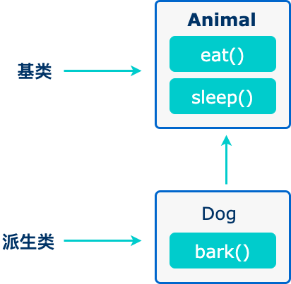

## javascript advance
[Javascript](https://www.w3schools.com/js/js_classes.asp)

[JavasCript](https://www.runoob.com/js/js-class-inheritance.html)

extend is the key word
super to invoke the parent class

JavaScript 类继承使用 extends 关键字。

"super" 方法用于调用父类的构造函数。